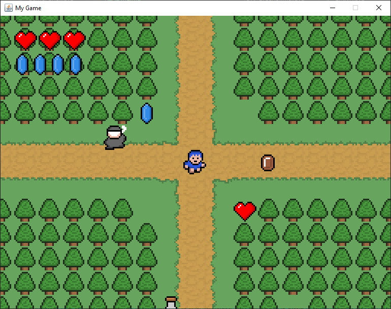

# 💙 Blue Boy

**Blue Boy** is a classic-style 2D pixel art game built entirely in Java **from scratch**, with no external game engine or framework. Inspired by retro RPGs and adventure games, Blue Boy offers an old-school visual and gameplay experience rendered on a grid-based tile map.


---

## 🕹️ Features

- 🎮 **Built from scratch in Java**: No libraries or game engines used—just raw Java and creativity!
- 🧭 **Top-down 2D map**: Grid-based movement with collision detection and environment interaction.
- ❤️ **Health system**: Collect heart icons to gain health.
- 💎 **Rupee-like collectibles**: Gather blue gems for points or currency.
- 🧍‍♂️ **Enemies and NPCs**: Simple AI behavior for enemies and future potential for dialogue/NPC interaction.
- 🪵 **Classic pixel art style**: Hand-drawn tiles and sprites for a nostalgic feel.

---

## 🧱 Tech Stack

- **Language:** Java (No external libraries)
- **Graphics:** Java AWT/Swing
- **Audio:** Java `javax.sound.sampled` (optional / for future use)
- **Tools:** Any Java IDE (e.g., IntelliJ IDEA, Eclipse, NetBeans)

---

## 🚀 Getting Started

### Requirements

- Java 8 or higher
- A Java IDE or terminal for compilation and running

### How to Run

1. Clone or download the repository:
   ```bash
   git clone https://github.com/yourusername/blue-boy.git
   cd blue-boy
   ```

2. Compile the project:
   ```bash
   javac Main.java
   ```

3. Run the game:
   ```bash
   java Main
   ```

   *(Replace `Main` with your actual main class if different.)*

---

## 📁 Project Structure

```bash
blue-boy/
├── assets/             # Sprites and tile images
├── src/
│   ├── main/           # Game entry point
│   ├── entity/         # Player, enemies, and NPCs
│   ├── tile/           # Tile map logic
│   └── ui/             # HUD elements (hearts, coins)
├── README.md
└── screenshot.png      # Preview image
```

---

## 🛣️ Roadmap / Future Scope

- 🗺️ More diverse tilemaps (caves, dungeons, villages)
- 👥 NPC interactions with dialogues
- ⚔️ Weapon and combat mechanics
- 🧠 Improved AI for enemies
- 💾 Save/load system
- 🎵 Sound effects and background music
- 🧪 Port to Android or Web (using Java frameworks or cross-compilers)

---

## 📜 License

This project is licensed under the MIT License. See `LICENSE` for more information.

---

## 🙌 Acknowledgements

- Inspired by classics like **Zelda**, **Pokémon**, and other SNES-era games
- All pixel assets are original or freely licensed

---

## 📷 Screenshot



---

Made with 💙 in Java.
